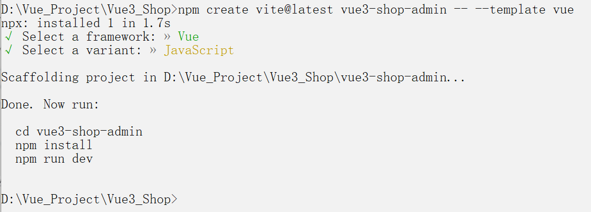
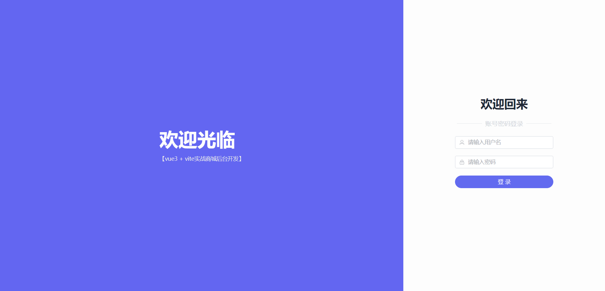
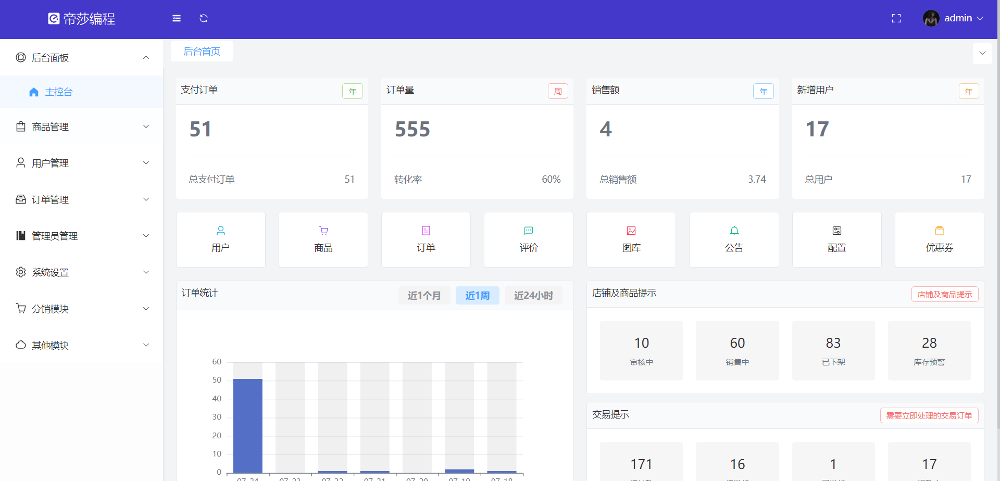

## 项目说明

- 项目名称：帝莎编程商城后台管理系统
- 技术说明：Vue3 + Vite + Vuex + ElementPlus + WindiCSS
- NodeJS 版本


## 项目运行

- 运行命令

````
两个接口文件夹说明
/api      本地开发文件夹，里面放的都是开发 API 接口文件，对应的是：http://ceshi13.dishait.cn
/api-test 测试文件夹，里面放的都是本地 API 接口文件，对应的是：/public/data

账号密码：admin-admin
测试命令：npm run vite:test
开发命令：npm run dev

开发接口：import {login} from '~/api/manager.js'
测试接口：import {login} from '~/api-test/manager.js'
环境接口：import {login} from '@api/manager.js'
````

- 项目文档

```
接口文档地址：http://dishaxy.dishait.cn/shopadminapi
网站演示地址：http://shopadmin.dishawang.com
接口数据地址：http://ceshi13.dishait.cn

Vite4：https://cn.vitejs.dev/config/
Vue3：https://cn.vuejs.org/
ElementPlus：https://element-plus.org/zh-CN/
WindiCSS：https://cn.windicss.org/
VueUse：https://vueuse.org/
VueX4：https://vuex.vuejs.org/zh/
VueRouter4：https://router.vuejs.org/zh/
```

- 创建项目
```
// 使用 Vite 创建 Vue3 项目
// https://cn.vitejs.dev/guide/
npm create vite@latest vue3-shop-admin -- --template vue
```



## 离线项目运行

```
// 运行测试环境
npm run vite:test

// API 相关的 JSON 文件地址
/public/data
// 测试是否可以用，直接在浏览器中输入
http://127.0.0.1:9080/data/manager/login.json

// 环境配置文件
NODE_ENV=test
VITE_NAME='测试环境'
VITE_API_SRC='api-test'
VITE_BASE_URL='/data'
```

## 运行效果

- 登录页面
  


- 后台管理页面


