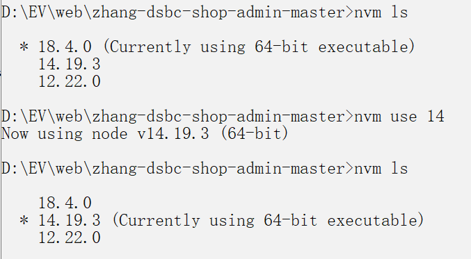
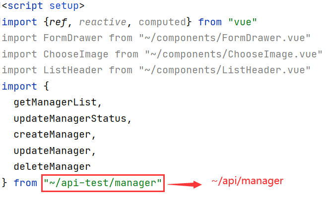

## 项目说明

- 项目名称：帝莎编程商城后台管理系统
- 技术说明：Vue3 + Vite + Vuex + ElementPlus + WindiCSS
- NodeJS 版本



- 运行说明

````
接口文档地址：http://dishaxy.dishait.cn/shopadminapi
网站演示地址：http://shopadmin.dishawang.com
接口数据地址：http://ceshi13.dishait.cn

两个接口文件夹说明
/api      本地开发文件夹，里面放的都是开发 API 接口文件，对应的是：http://ceshi13.dishait.cn
/api-test 测试文件夹，里面放的都是本地 API 接口文件，对应的是：/public/data

账号密码：admin-admin
测试命令：npm run vite:test
开发命令：npm run dev

开发接口：import {login} from '~/api/manager.js'
测试接口：import {login} from '~/api-test/manager.js'
环境接口：import {login} from '@api/manager.js'
````



## 离线项目运行

```
// 运行测试环境
npm run vite:test

// API 相关的 JSON 文件地址
/public/data
// 测试是否可以用，直接在浏览器中输入
http://127.0.0.1:9080/data/manager/login.json

// 环境配置文件
NODE_ENV=test
VITE_NAME='测试环境'
VITE_API_SRC='api-test'
VITE_BASE_URL='/data'
```

- vite.config.js 配置文件

```
import {defineConfig, loadEnv} from 'vite'
import vue from '@vitejs/plugin-vue'
import WindiCSS from 'vite-plugin-windicss'
import path from 'path'

// https://vitejs.dev/config/
export default defineConfig(({command, mode}) => {
  const config = loadEnv(mode, './')
  // console.log(config)
  // console.log(path.resolve(__dirname, "src", config.VITE_API_SRC))
  return {
    plugins: [vue(), WindiCSS()],
    // 配置项目根路径别名
    resolve: {
      alias: {
        "~": path.resolve(__dirname, "src"),
        "@api": path.resolve(__dirname, "src", config.VITE_API_SRC)
      }
    },
    server: {
      open: false, // 项目启动时是否打开页面
      port: '9080', // 项目启动时的端口号
      // 解决跨域问题
      proxy: {
        '/api': {
          target: 'http://ceshi13.dishait.cn',
          changeOrigin: true,
          rewrite: (path) => path.replace(/^\/api/, '')
        },
      }
    }
  }
})
```
